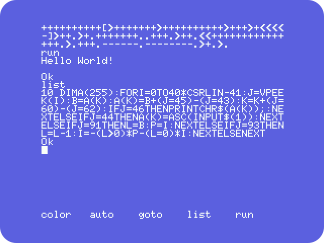
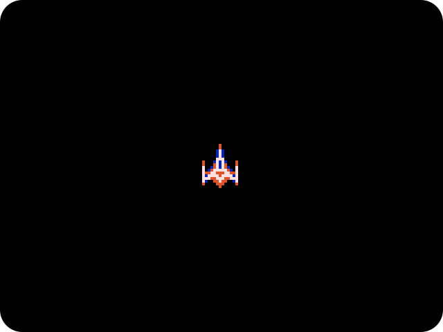
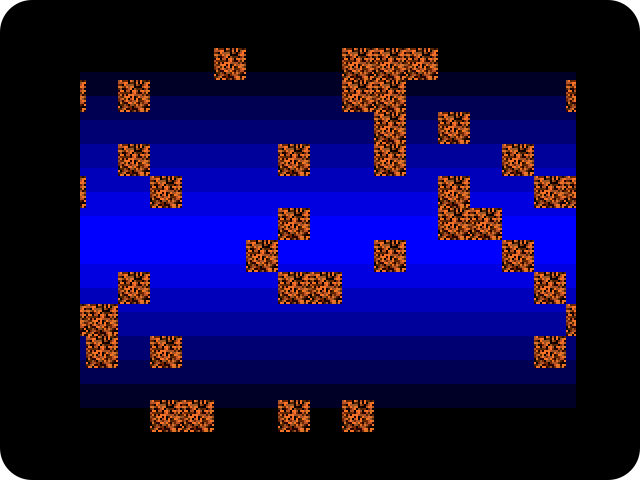
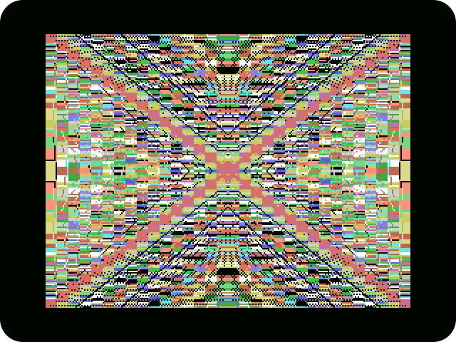
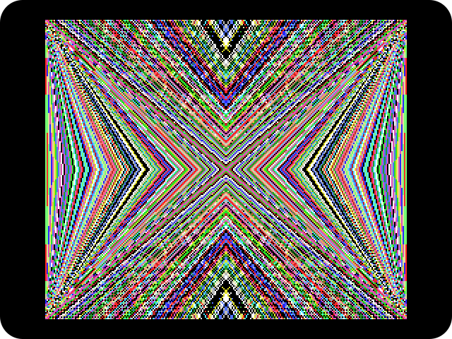
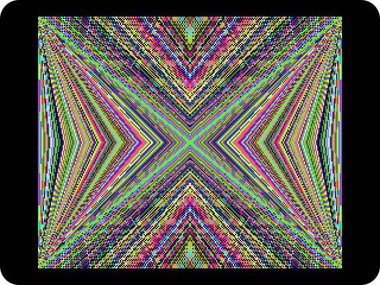
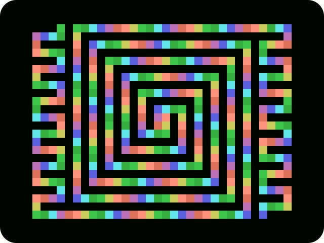
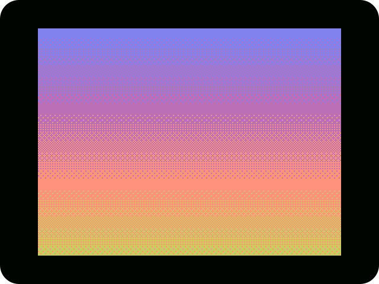

# Examples for MSX

There are few examples of programs using Inlier's syntax.

## brainfuck.bas

A [brainfuck](https://en.wikipedia.org/wiki/Brainfuck) interpreter in a single BASIC line.



There is a 'hello world' in Brainfuck as sample code:
```
++++++++++[>+++++++>++++++++++>+++>+<<<<-]>++.>+.+++++++..+++.>+
+.<<+++++++++++++++.>.+++.------.--------.>+.>.
```

## colored_sprite.bas

Example of MSX2's colored sprites using "OR method" to obtain a 3rd color on the intersection of two sprites.



## hardware_scroll.bas

Simple animation using MSX2+'s hardware scrolling.



## kaleidoscope2.bas

Kaleidoscope program for MSX1 in 256×192, 16 colors and color clashing (SCREEN 2).



## kaleidoscope5.bas

Kaleidoscope program for MSX2 in 256×212 and 16 colors (SCREEN 5).



## kaleidoscope8.bas

Kaleidoscope program for MSX2 in 256×212 and 256 colors (SCREEN 8).



## spiral.bas

Simple animation on the 32×24 text mode (SCREEN 1).



## sunset.bas

A pretty sunset pattern.


